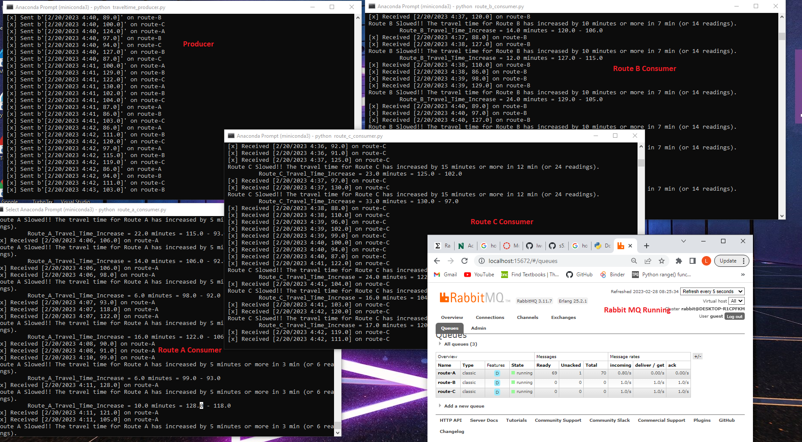
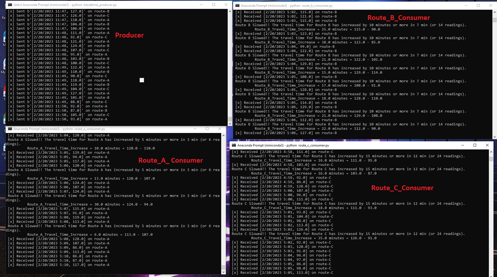

Loni Wood  

February 23, 2023

Module 7 - Option 1: Custom Project

# Overview:
The purpose of this assignment is to create a custom streaming project.  This particular code is taking a  csv file and creating a producer with three consumers.  Each column of the csv will be sent to individual queues.

# Before you begin
Before you start, be sure you have the following installed and running.
- pika
- deque
- RabbitMQ:
    You can find additional information on how to set up RabbitMQ at: https://www.rabbitmq.com/download.html
- active conda environment
- open anaconda prompt terminal

# How to run this program:
## Files you will be using:
 - traveltime_producer.py
     - You will need to review the following and make updates if needed:
        - Check your host.  If it is not the "localhost", update
        - Determine if you would like to have the RabbitMQ website prompt you to open. If you do, ensure that show_offer is set to True, otherwise set it to False.
 
 - traveltime.csv
     - There are 4 columns in this csv file
        - Time = Date-time stamp for each reading
        - Route A = Route A Time
        - Route B = Route B Time 
        - Route C = Route C Time 
     - This is faker data
 - route_a_consumer.py
    - You will need to review the following ane make updates if needed:
      - Check your host.  If it is not the "localhost", update

 - route_b_consumer.py
    - You will need to review the following ane make updates if needed:
      - Check your host.  If it is not the "localhost", update

 - route_c_consumer.py
    - You will need to review the following ane make updates if needed:
      - Check your host.  If it is not the "localhost", update

- Additional Notes:  The traveltime_producer.py has skipped over any blank rows so therefore there will be no blank rows sent to the consumers. 

# Assignment - Travel Time Custom Project (Option 1)

1.  Create a custom GitHub project repo to showcase your skills. - Completed
2.  Describe and plan an new implementation using RabbitMQ for streaming data. - Completed
3.  Create one or more custom producers. - Completed.  1 Producer was created for this project.
4.  Create one or more custom consumers. - Completed.  3 Consumers were created for this project. 
5.  You can simulate your initial data source using Faker or some other file - or read from an API (not too much, too often, or too fast!) - Completed.  Using Faker data for this project.
5.  How did you explore exchanges and queues?  I used the default exchange and 3 different queues: route-A, route-B, route- C
6.  Did you use time windows?  yes
7.  What made this an interesting streaming project for you?  I was actually listening to the news and you constantly see in the mornings about travel times to certain locations.  I wanted to see this scenario play out in a streaming project.

## Project Description
The scenario I considered was travel times based on routes.  If there are 3 different routes to a destination, I wanted to see what it would look like when alerts were sent if or when travel times increase in a certain window.

## Significant Events
We want to know if:

- Route A increases by more than 5 minutes in 3 minutes (RouteA Slowed) 
- Route B increased by more than 10 minutes in 7 minutes (RouteB Slowed)
- Route C increased by more than 15 minutes in 12 minutes (RouteC Slowed)

## Consumer Requirements
We need to set up our consumers to account for the following:
- Alert to Send:
  - Route A increases by more than 5 minutes in 3 minutes (RouteA Slowed) 
  - Route B increased by more than 10 minutes in 7 minutes (RouteB Slowed)
  - Route C increased by more than 15 minutes in 12 minutes (RouteC Slowed)

- Time Windows:
  - Route A time window is 3 minutes
  - Route B time window is 7 minutes
  - Route C time window is 12 minutes 

- Deque Max Length:
  - At one reading every 1/2 minute, route A max length is 6 (3 min * 1 reading/0.5 min)
  - At one reading every 1/2 minute, route B max length is 14 (7 min * 1 reading/0.5 min)
  - At one reading every 1/2 minute, route C max length is 24 (12 min * 1 reading/0.5 min)

- Condition To Monitor:
  - If route A increases by 5 mins or more in 3 min (or 6 readings)  --> RouteA Slowed!
  - If route B increases by 10 mins or more in 7 min (or 14 readings)  --> RouteB Slowed!
  - If route C increases by 15 mins or more in 12 mins (or 24 readings) --> RouteC Slowed!

## Describe your unique steaming analytics project - what / why
I was watching the news one morning and travel times were being discussed.  Accidents, weather conditions, and vehicle breakdowns play a part in any travel delays.  I would assume that when people are notified of travel delays, travelers consider different routes, which then could end up with certain delays.  I wanted to see travel time play out in a streaming project.

## Describe and link to your data original data sources.
There wasn't an original data source since I chose to go with faker data. However, to help me get "travel times", I did use a random number generator website.  https://www.calculatorsoup.com/calculators/statistics/random-number-generator.php  From this website, I entered the number range from 85 - 130, copied and saved the numbers into an excel.  I repeated this for my other two columns/"routes."  I added a date and timestamp to my spreadsheet.  Since I didn't want to have too perfect of a dataset, I randomly went through and removed travel times from each of my routes.  My spreadsheet was then saved as a CSV.

## Describe your process - producers, consumers, exchanges, queues

- Producer:  I have one producer that I am using for this project which pulls from the traveltime.csv file.  In my python code, I passed over any blanks to allow for my numbers to be converted to floats.  The producer puts the timestamp and travel time together to be sent to the consumers.  The producer sorts the columns into 3 different queues:  route-A, route-B, route-C

- Consumers:  For this project there are 3 consumers each with their own queues and call backs. The alert messages also show what the travel time increase is at the time of the alert.  The alerts that are sent are:
  - For Route A:  RouteA Slowed!! The travel time for Route A has increased by 5 minutes or more in 3 min (or 6 readings)
  - For Route B:  Route B Slowed!! The travel time for Route B has increased by 10 minutes or more in 7 min (or 14 readings).
  - For Route C:  Route C Slowed!! The travel time for Route C has increased by 15 minutes or more in 12 min (or 24 readings).

- Exchanges:  I used the default exchange.

- Queues:  I have 3 queues, 1 for each consumer:  route-A, route-B, route-C

## Provide clickable links to the output of your simulation or process.

Output Producer:  https://github.com/lwood7983/streaming-07-custom-project/blob/main/producer_.txt

Output Consumers:
- Route A:  https://github.com/lwood7983/streaming-07-custom-project/blob/main/route_a.txt
- Route B:  https://github.com/lwood7983/streaming-07-custom-project/blob/main/route_b.txt
- Route C:  https://github.com/lwood7983/streaming-07-custom-project/blob/main/route_c.txt

# Screenshots of Program Running:

## Screenshot of the Producer and 3 Consumers running:
Running producer and consumers.  Image below shows all 4 terminals running along with RabbitMQ running the queues.

Running producer and consumers. Image below shows all 4 terminals running with alert messages. Set time to 1/2 second in order to capture the images.

